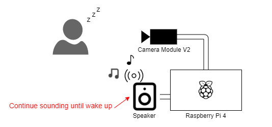

# SmartAlarm
Smart alarm application in raspberry pi.

## Overview

* Sounds the alarm when the current time match the setting time and day of the week.
* Detect spleepiness from the camera.
* Continue sounding until wake up.



## Requirement

### Devices
* Raspberry Pi 4
* Camera Module V2 For raspberry pi
* ROUNDS portable speaker

### Packages
* python3
* pyaudio
* opencv
* dlib
* imutils
* scipy

## Installation

```
pip3 install pyaudio opencv-python dlib imutils scipy
```

## Usage

Set the alarm setting
```json:settings\alarmSetting.json
[
  {
    "time": "07:00",
    "days": [
      "Sun",
      "Mon",
      "Tue",
      "Web",
      "Thu",
      "Fri",
      "Sat"
    ]
  }
]
```


Run application
```
python3 src/main.py
```